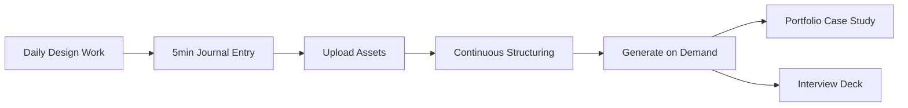
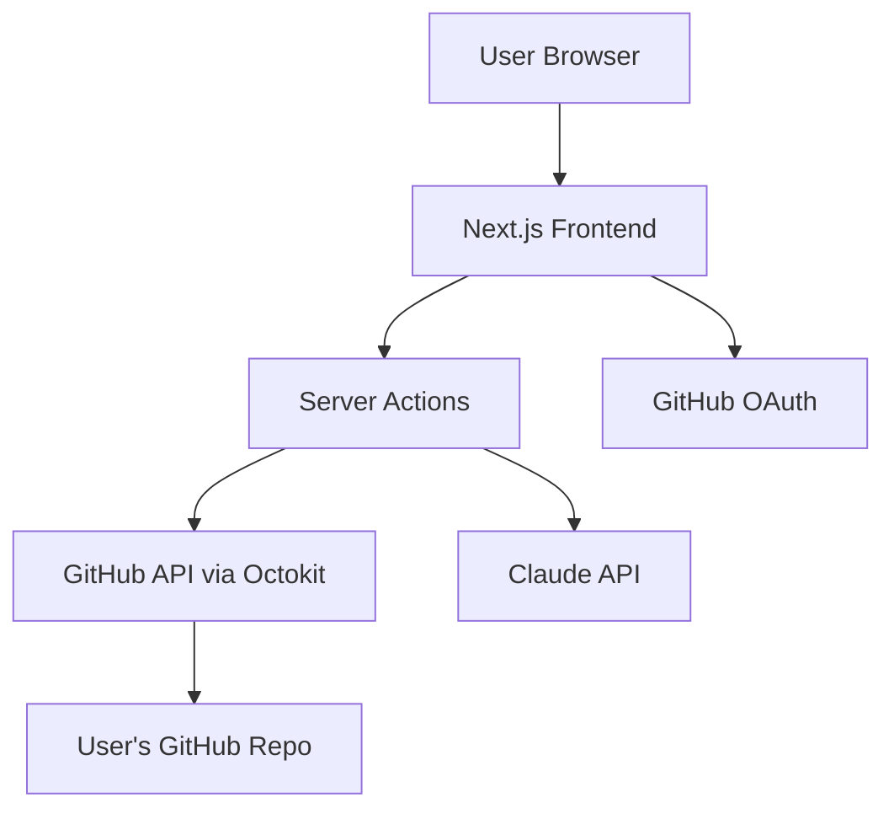

# PRD: Case Study Companion

**Version**: 1.0  
**Last Updated**: January 2026  
**Status**: Ready for Development

---

## Executive Summary

**Case Study Companion** is a personal web app that transforms portfolio case study creation from a dreaded last-minute chore into an emergent artifact of ongoing work. Built for experienced product designers, it captures decisions, milestones, and assets during project execution, then generates polished portfolio case studies and interview presentations on demand.

**Core Innovation**: Instead of retroactive documentation, designers journal their work in 5-minute daily entries. The app uses AI to synthesize these entries into portfolio-ready outputs.

**Tech Stack**: Next.js web app hosted on Vercel, using GitHub as a file-based database and Claude AI for content synthesis.

**Primary Value**: Designers maintain a living record of their work and can generate high-quality case studies and presentations whenever needed—without starting from a blank page.

---

## Table of Contents

1. [Problem Statement](#1-problem-statement)
2. [Target User](#2-target-user)
3. [Product Vision & Goals](#3-product-vision--goals)
4. [Core Concept](#4-core-concept)
5. [Jobs to be Done](#5-jobs-to-be-done)
6. [Key User Flows](#6-key-user-flows)
7. [Feature Specifications](#7-feature-specifications)
8. [Technical Architecture](#8-technical-architecture)
9. [Data Model & Storage](#9-data-model--storage)
10. [AI Integration](#10-ai-integration)
11. [Export & Delivery](#11-export--delivery)
12. [MVP Scope & Phasing](#12-mvp-scope--phasing)
13. [Non-Functional Requirements](#13-non-functional-requirements)
14. [Success Metrics](#14-success-metrics)
15. [Design Principles](#15-design-principles)
16. [Competitive Landscape](#16-competitive-landscape)
17. [Open Questions & Future Considerations](#17-open-questions--future-considerations)
18. [Glossary](#18-glossary)

---

## 1. Problem Statement

Creating strong portfolio case studies is disproportionately painful compared to their value.

### Pain Points for Experienced Designers

**During the project:**
- Too busy executing to document decisions
- Context and rationale get lost over time
- Assets pile up without organization or naming

**After the project:**
- Memory fades—key decisions and reasoning become fuzzy
- Staring at a blank page with 6 months of work to synthesize
- Rushed writing leads to either verbose rambling or under-explanation
- Missing the compelling "why" that would resonate in interviews

### Current Workarounds

- **Ad-hoc note-taking**: Scattered across Notion, Slack, design files
- **Post-project documentation**: Written too late, often rushed before job searches
- **Generic templates**: Don't capture project-specific nuance or designer voice
- **Skipping altogether**: Many great projects never make it to portfolios

### Impact

- Designers miss interview opportunities due to weak portfolios
- Great work goes undocumented and unshared
- Portfolio updates become anxiety-inducing events
- Career growth stalls due to poor self-advocacy

---

## 2. Target User

### Primary User Profile

**Role**: Lead or Senior Product Designer  
**Work Context**: Actively working on complex, multi-month projects  
**Characteristics**:
- 5+ years experience in product design
- High taste, low tolerance for generic advice or templates
- Already has a portfolio site (personal domain or platform)
- Preparing for or open to new opportunities
- Values clear thinking and communication
- Understands the importance of case studies but struggles to create them

### User Needs

- Lightweight capture during busy project phases
- Preservation of decision-making context and rationale
- Efficient transformation of raw notes into polished narratives
- Maintained authorial voice (not AI ghostwriting)
- Flexibility to edit and refine AI-generated content

### Explicit Non-Users

- Junior designers learning portfolio basics
- Recruiters or hiring managers (they're readers, not users)
- Design students building first portfolios
- Other creative roles (dev, PM, content) seeking generic portfolio tools

---

## 3. Product Vision & Goals

### Vision Statement

Make case study creation an ongoing, low-friction practice rather than a high-anxiety, last-minute project.

### Product Goals

1. **Emergent Artifacts**: Case studies materialize from accumulated work, not created from scratch
2. **Authorial Voice**: Reduce writing friction while preserving the designer's unique perspective and tone
3. **Real-Time Capture**: Log decisions and milestones while context is fresh
4. **Dual Output**: Generate both portfolio case studies and interview presentations from the same data
5. **Lightweight Discipline**: Daily journaling takes ≤5 minutes; feels like a natural workflow habit

### Success Vision

A designer finishes a project phase and can generate a draft case study in minutes that:
- Accurately represents their work and decisions
- Requires only light editing, not wholesale rewriting
- Includes well-organized, contextual assets
- Translates smoothly into an interview presentation
- Sounds like them, not a generic AI

---

## 4. Core Concept

### The Journaling-First Approach

Instead of writing a case study retrospectively, designers **journal their work progressively**:



### How It Works

1. **During the project**: Designer logs 3-5 quick responses daily (decisions, milestones, tradeoffs)
2. **Throughout the project**: Assets are uploaded and automatically tagged/organized
3. **Continuously**: The system structures entries into themes and narrative arcs
4. **On demand**: Generate portfolio case study or presentation outline
5. **Before publishing**: Designer reviews, edits, and refines in their voice

### Key Insight

Most case study content already exists in designers' heads and Slack messages—it just needs to be captured at the right moments and structured for storytelling.

---

## 5. Jobs to be Done

### Primary JTBD

> **When** I'm actively working on a design project,  
> **I want to** quickly capture key decisions, changes, and artifacts as they happen,  
> **So that** creating a case study or interview presentation later is fast, accurate, and low-stress.

### Supporting JTBD

**JTBD #2: Asset Organization**
> When I create design artifacts (screenshots, diagrams, prototypes), I want them automatically organized and contextualized, so that I don't have chaotic folders of "Screen Shot 2024-01-15 at 2.34.18 PM.png"

**JTBD #3: Interview Preparation**
> When I have a portfolio review or design interview coming up, I want to quickly prepare a structured 30-minute presentation, so that I can focus on practice rather than deck creation.

**JTBD #4: Memory Preservation**
> When my memory of project details fades over time, I want a reliable record of what I did and why, so that I can speak authentically about my work months or years later.

---

## 6. Key User Flows

### 6.1 Onboarding & Setup

**First-Time Experience**

1. User lands on app, sees value proposition
2. Click "Get Started" → GitHub OAuth login
3. App requests repo access (read/write)
4. User chooses:
   - Create new repo (e.g., "design-journal")
   - Use existing repo
5. App initializes folder structure
6. Optional: Load a sample project for exploration

**Duration**: ~2 minutes

### 6.2 Project Creation

**Flow**

1. User clicks "New Project"
2. Fill out project setup form:
   - **Project name** (e.g., "Mobile checkout redesign")
   - **Role** (e.g., "Lead Product Designer")
   - **Timeframe** (e.g., "Jan 2024 - Apr 2024")
   - **Problem space** (2-3 sentences)
   - **Constraints**:
     - Team size/composition
     - Timeline
     - Scope limitations
     - Technical constraints
3. App creates project folder structure in GitHub
4. User lands on empty project dashboard

**Duration**: ~3 minutes

### 6.3 Daily Journaling (Core Loop)

**Trigger Mechanisms** (MVP: Manual)
- User visits app and sees "Journal Today" prompt
- Future: Optional email reminder at end of workday
- Future: Slack/notification reminder

**Flow**

1. User clicks "Add Journal Entry"
2. App displays 3-5 prompts (adaptive based on project phase):
   - "What decision did you make today?"
   - "What milestone did you hit or move closer to?"
   - "What changed from the previous iteration?"
   - "What tradeoff or tension came up?"
   - "What feedback influenced today's work?"
3. User types short responses (bullets or brief paragraphs)
4. User can optionally:
   - Upload assets (drag & drop)
   - Add lightweight tags (auto-suggested: decision, milestone, iteration, feedback)
5. Click "Save Entry"
6. Entry is committed to GitHub as markdown file

**Duration**: ~5 minutes or less  
**Frequency**: Daily (ideal), or 2-3x per week minimum

**Example Journal Entry**

```markdown
# January 15, 2024

**Decision**: Moved from tab navigation to bottom sheet for filters
**Why**: Testing showed users expected filters to be temporary, not persistent state
**Tradeoff**: Loses discoverability but gains mental model clarity

**Milestone**: Completed high-fidelity prototypes for user testing round 2

**Assets**:
- before-after-navigation.png
- filter-bottom-sheet-v3.png
```

### 6.4 Asset Upload & Organization

**Flow**

1. User uploads screenshot or diagram (during journal entry or separately)
2. App analyzes image and suggests:
   - **Role**: Before, After, Exploration, Final, Process
   - **Descriptive name**: "checkout-flow-iteration-3" vs "Screen Shot..."
   - **Story placement**: Which decision/milestone it supports
3. User can accept, edit, or override suggestions
4. Asset is committed to GitHub with metadata

**Smart Features**
- Detect before/after patterns (similar images)
- Recognize Figma screenshots vs product screenshots
- Suggest grouping related images
- Auto-generate alt text for accessibility

### 6.5 Case Study Generation

**Flow**

1. User navigates to project, clicks "Generate Case Study"
2. App analyzes all journal entries and assets
3. Loading state (~10-30 seconds)
4. Generated case study appears in editor with sections:
   - Overview
   - Problem & Constraints
   - Key Decisions
   - Process Highlights
   - Outcomes & Learnings
5. User can:
   - Edit text inline
   - Reorder sections
   - Add/remove assets
   - Adjust tone (toggle: more concise / more detailed)
   - Regenerate specific sections
6. Export to HTML when satisfied

**Tone Controls** (Voice Toggle)
- **Default**: Balanced—professional but conversational
- **Concise Mode**: Tighter, more bullet-driven
- **Detailed Mode**: More context and explanation
- **Regenerate**: "Rewrite this section with more emphasis on impact"

### 6.6 Presentation Generation

**Flow**

1. From case study view, click "Create Presentation"
2. App generates presentation outline:
   - 8-12 slides for 30-minute presentation
   - Slide titles
   - Bullet points per slide
   - Speaker notes with talking points
   - Suggested time allocation
3. User reviews and edits structure
4. Export options:
   - Download as JSON
   - Copy markdown outline
   - Export to Google Slides (future)

**Presentation Structure Template**

```
Slide 1: Title (30 sec)
Slide 2: Problem Context (3 min)
Slide 3: Constraints & Scope (2 min)
Slide 4-7: Key Decisions (15 min - ~4 min each)
Slide 8: Process Highlights (3 min)
Slide 9: Outcomes & Impact (4 min)
Slide 10: Reflections & Learnings (2 min)
Slide 11: Q&A (flexible)
```

---

## 7. Feature Specifications

### 7.1 Project Dashboard

**Components**
- Project metadata card (name, dates, status)
- Journal entry timeline (chronological)
- Asset gallery (filterable by type/tag)
- Quick stats (# entries, # assets, last updated)
- Action buttons (Add Entry, Generate Case Study, Generate Presentation)

**Functionality**
- Search within project
- Filter by tags
- View entry history
- Export project data

### 7.2 Journal Entry Editor

**Features**
- Rich text markdown editor
- Prompt suggestions (adaptive)
- Auto-save (debounced)
- Asset uploader (drag & drop)
- Tag picker (auto-suggest + custom)
- Date/time stamp (editable)
- Entry templates for common types

**Prompts Adaptation**
- Early project: Focus on problem space, constraints, goals
- Mid project: Decisions, iterations, feedback
- Late project: Outcomes, learnings, impact measurement

### 7.3 Asset Management

**Upload**
- Drag & drop or file picker
- Supported formats: PNG, JPG, GIF, PDF
- Max file size: 10MB per file
- Batch upload support

**Organization**
- AI-suggested naming
- Role classification (Before, After, Exploration, Final, Process, Other)
- Link to journal entries
- Link to case study sections
- Custom tags
- Alt text for accessibility

**Display**
- Grid view (thumbnails)
- List view (with metadata)
- Lightbox for full view
- Download original

### 7.4 Case Study Generator

**Input**
- All journal entries for project
- All uploaded assets
- Project metadata
- Optional: User tone preferences

**Processing**
- Aggregate entries by theme
- Identify key decisions and their context
- Map assets to narrative moments
- Generate section structure
- Write initial draft (Claude API)

**Output**
- Editable HTML/Markdown document
- Embedded images with proper sizing
- Structured sections
- Meta information (reading time, word count)

**Customization**
- Section reordering
- Section regeneration
- Tone adjustment
- Manual editing preserved across regenerations

### 7.5 Presentation Builder

**Input**
- Generated case study (or journal entries if case study not generated)
- Time constraint (default: 30 minutes)
- Audience type (optional: recruiter, design team, executive)

**Output**
- Slide outline (titles + bullets)
- Speaker notes per slide
- Time allocation
- Asset suggestions per slide

**Export Formats**
- JSON (structured data)
- Markdown (readable outline)
- HTML (formatted for copy-paste)
- Future: PPTX, Google Slides integration

---

## 8. Technical Architecture

### Tech Stack

**Frontend**
- Framework: Next.js 14+ (App Router)
- Language: TypeScript
- UI Library: React 18+
- Server Components: Yes (for GitHub API calls)
- Client Components: Yes (for interactive features)

**Styling**
- CSS Framework: Tailwind CSS
- Component Library: shadcn/ui (recommended)
- Icons: Lucide React or Heroicons
- Typography: System fonts + optional Google Fonts

**Hosting & Deployment**
- Platform: Vercel
- Deployment: Git-based continuous deployment
- Environment: Serverless functions

**Database/Storage**
- Primary: GitHub API (file-based)
- Local state: React Context / Zustand
- Caching: React Query or SWR

**AI Provider**
- Service: Anthropic Claude API (Claude 3.5 Sonnet or Opus)
- Use cases: Content generation, suggestions, synthesis

**Authentication**
- Provider: GitHub OAuth
- Session: Next-Auth or Clerk
- Scope: repo (read/write access)

**File Storage**
- Location: GitHub repository
- Format: Markdown for entries, JSON for metadata, binary for images

### System Architecture



### API Routes

**Next.js API Routes / Server Actions**

- `/api/auth/*` - GitHub OAuth handling
- `/api/projects` - CRUD operations for projects
- `/api/journal` - CRUD operations for journal entries
- `/api/assets` - Upload and manage assets
- `/api/generate/case-study` - Generate case study via Claude
- `/api/generate/presentation` - Generate presentation via Claude
- `/api/export` - Export to various formats

### Libraries & Dependencies

**Core**
- `next` - React framework
- `react` - UI library
- `typescript` - Type safety

**GitHub Integration**
- `@octokit/rest` - GitHub API client
- `@octokit/auth-oauth-app` - OAuth handling

**AI Integration**
- `@anthropic-ai/sdk` - Claude API client

**UI/UX**
- `tailwindcss` - Styling
- `@radix-ui/*` - Headless components (via shadcn/ui)
- `lucide-react` - Icons
- `react-hook-form` - Form handling
- `zod` - Schema validation

**Utilities**
- `date-fns` - Date manipulation
- `gray-matter` - Markdown frontmatter parsing
- `remark` / `rehype` - Markdown processing
- `swr` or `@tanstack/react-query` - Data fetching

**Export**
- `html2canvas` - Screenshots (if needed)
- Future: `pptxgenjs` - PowerPoint generation

---

## 9. Data Model & Storage

### GitHub Repository Structure

The user's GitHub repository will follow this structure:

```
user-github-repo/
├── .casestudy/
│   └── config.json              # App configuration
├── projects/
│   ├── mobile-checkout-redesign/
│   │   ├── meta.json            # Project metadata
│   │   ├── journal/
│   │   │   ├── 2024-01-15.md
│   │   │   ├── 2024-01-16.md
│   │   │   └── 2024-01-20.md
│   │   ├── assets/
│   │   │   ├── before-after-navigation.png
│   │   │   ├── filter-bottom-sheet-v3.png
│   │   │   └── .metadata/
│   │   │       ├── before-after-navigation.json
│   │   │       └── filter-bottom-sheet-v3.json
│   │   └── generated/
│   │       ├── case-study.md
│   │       ├── case-study.html
│   │       └── presentation.json
│   └── design-system-evolution/
│       └── [same structure]
└── README.md                     # User-facing documentation
```

### Data Schemas

#### Project Metadata (`meta.json`)

```json
{
  "id": "mobile-checkout-redesign",
  "name": "Mobile Checkout Redesign",
  "role": "Lead Product Designer",
  "timeframe": {
    "start": "2024-01-01",
    "end": "2024-04-30",
    "status": "in-progress"
  },
  "problemSpace": "Users were abandoning checkout at 45% rate on mobile...",
  "constraints": {
    "team": "1 designer, 2 engineers, 1 PM",
    "timeline": "3 months to ship",
    "scope": "Mobile web only, no app changes",
    "technical": "Must work with existing payment gateway"
  },
  "tags": ["mobile", "ecommerce", "conversion"],
  "createdAt": "2024-01-01T10:00:00Z",
  "updatedAt": "2024-01-20T15:30:00Z"
}
```

#### Journal Entry (`YYYY-MM-DD.md`)

```markdown
---
date: 2024-01-15
tags: [decision, milestone]
assets: [before-after-navigation.png, filter-bottom-sheet-v3.png]
---

# January 15, 2024

## What decision did you make today?
Moved from tab navigation to bottom sheet for filters

## Why did you make this decision?
Testing showed users expected filters to be temporary, not persistent state. Tabs implied a mode switch, which confused users.

## What tradeoff came up?
Loses discoverability but gains mental model clarity. We're betting that users who need filters will find them via the prominent button.

## What milestone did you hit?
Completed high-fidelity prototypes for user testing round 2
```

#### Asset Metadata (`.metadata/filename.json`)

```json
{
  "filename": "before-after-navigation.png",
  "uploadedAt": "2024-01-15T14:30:00Z",
  "role": "before-after",
  "suggestedName": "navigation-comparison-tabs-vs-sheet",
  "linkedEntries": ["2024-01-15"],
  "linkedSections": ["key-decisions"],
  "altText": "Side-by-side comparison showing tab navigation on left and bottom sheet navigation on right",
  "tags": ["navigation", "iteration"],
  "fileSize": 234567,
  "dimensions": "1200x800"
}
```

#### Generated Case Study (`case-study.md`)

```markdown
---
generatedAt: 2024-04-30T10:00:00Z
version: 1
tone: balanced
sections: [overview, problem, decisions, process, outcomes]
---

# Mobile Checkout Redesign

## Overview
[Generated content...]

## Problem & Constraints
[Generated content...]

...
```

#### Presentation Outline (`presentation.json`)

```json
{
  "generatedAt": "2024-04-30T11:00:00Z",
  "duration": 30,
  "slides": [
    {
      "number": 1,
      "title": "Mobile Checkout Redesign",
      "type": "title",
      "duration": 0.5,
      "bullets": [],
      "speakerNotes": "Introduce yourself and the project context",
      "assets": []
    },
    {
      "number": 2,
      "title": "The Problem: 45% Abandonment Rate",
      "type": "problem",
      "duration": 3,
      "bullets": [
        "Mobile checkout abandonment at 45% (desktop: 28%)",
        "User research revealed 3 core friction points",
        "Business impact: $2M annual revenue opportunity"
      ],
      "speakerNotes": "Start with the business context...",
      "assets": ["checkout-funnel-analytics.png"]
    }
  ]
}
```

### Configuration File (`.casestudy/config.json`)

```json
{
  "version": "1.0",
  "user": {
    "githubUsername": "designername",
    "preferences": {
      "defaultTone": "balanced",
      "journalReminders": false,
      "autoSuggestAssetNames": true
    }
  },
  "app": {
    "repoName": "design-journal",
    "createdAt": "2024-01-01T09:00:00Z"
  }
}
```

---

## 10. AI Integration

### Claude API Usage

**Use Cases**

1. **Journal Prompt Generation**
   - Input: Project phase, recent entries
   - Output: 3-5 contextual prompts
   - Frequency: Daily or per entry

2. **Asset Naming & Classification**
   - Input: Image data (base64), project context
   - Output: Suggested name, role, description
   - Frequency: Per asset upload

3. **Case Study Synthesis**
   - Input: All journal entries, project metadata, assets
   - Output: Structured case study sections
   - Frequency: On-demand (not real-time)

4. **Presentation Outline Generation**
   - Input: Case study or journal entries, time constraint
   - Output: Slide structure with talking points
   - Frequency: On-demand

### Prompt Strategy

**System Prompt Principles**
- Act as an editor and interviewer, not a ghostwriter
- Preserve user's voice and phrasing when possible
- Ask clarifying questions rather than inventing details
- Prioritize clarity and structure over flowery language
- Maintain professional but conversational tone

**Example System Prompt (Case Study Generation)**

```
You are an experienced design portfolio editor helping a designer create a case study. 

Your role:
- Synthesize their journal entries into a coherent narrative
- Preserve their voice, decisions, and reasoning
- Structure content for portfolio readers (hiring managers, other designers)
- Keep it visual-first and scannable
- Don't invent details not present in the entries

The designer values:
- Clarity over cleverness
- Showing tradeoffs and constraints, not just wins
- Authentic voice, not corporate speak

Output format: Markdown with clear section headers
```

### Rate Limiting & Cost Management

**Optimization Strategies**
- Cache generated content (store in `generated/` folder)
- Only regenerate sections that changed
- Use smaller models for simple tasks (naming, prompts)
- Use larger models for synthesis (case study, presentation)
- Implement request debouncing
- Show cost estimates to user

**Error Handling**
- Graceful degradation if API fails
- Local fallbacks for simple features
- Retry logic with exponential backoff
- User-friendly error messages

---

## 11. Export & Delivery

### HTML Export (Case Study)

**Requirements**
- Self-contained HTML file with embedded CSS
- Responsive design (mobile-friendly)
- Images either embedded (base64) or linked
- Copy-pasteable into portfolio site
- Print-friendly CSS

**Format**

```html
<!DOCTYPE html>
<html>
<head>
  <style>
    /* Embedded Tailwind or custom CSS */
  </style>
</head>
<body>
  <article class="case-study">
    <header>...</header>
    <section class="overview">...</section>
    ...
  </article>
</body>
</html>
```

### Presentation Export

**MVP: JSON + Markdown**

JSON structure (as defined in data model) that can be:
- Imported into custom tools
- Converted to other formats later

Markdown outline for easy copy-paste:

```markdown
# Slide 1: Title
- Project name
- Your role
- Time: 30 seconds

Speaker notes: Brief intro...

---

# Slide 2: Problem Context
- Point 1
- Point 2
- Time: 3 minutes

Speaker notes: Start with the business context...
```

**Future: Direct Export**
- Google Slides API integration
- PowerPoint (.pptx) generation via library
- Keynote-compatible formats

### Export Options UI

**Features**
- Preview before export
- Choose embedded vs linked images
- Select which sections to include
- Copy to clipboard vs download
- Export settings saved per project

---

## 12. MVP Scope & Phasing

### Phase 1: Core Journal Loop (MVP v1)

**Priority**: Get users capturing data consistently

**Features**
- ✅ GitHub OAuth authentication
- ✅ Project creation with metadata
- ✅ Daily journal entry (manual, 3-5 fixed prompts)
- ✅ Manual asset upload
- ✅ Basic asset naming suggestions
- ✅ Project dashboard (view entries and assets)
- ✅ Markdown export of raw entries

**Out of Scope for Phase 1**
- ❌ AI-generated case studies
- ❌ Presentation builder
- ❌ Adaptive prompts
- ❌ Advanced asset organization
- ❌ HTML export

**Success Criteria**
- User can journal consistently (3+ entries/week)
- Asset upload is painless
- No data loss (reliable GitHub sync)

**Estimated Complexity**: Medium (2-3 weeks)

---

### Phase 2: Case Study Generation

**Priority**: Deliver the core value proposition

**Features**
- ✅ Case study generation via Claude API
- ✅ Editable case study interface
- ✅ Tone controls (concise/balanced/detailed)
- ✅ Section regeneration
- ✅ HTML export with embedded CSS
- ✅ Asset placement in case study

**Success Criteria**
- Generated case study requires <30 min editing
- 80% of users rate voice match as "good" or better
- HTML export works in common portfolio platforms

**Estimated Complexity**: High (3-4 weeks)

---

### Phase 3: Presentation Builder

**Priority**: Complete the dual-output promise

**Features**
- ✅ Presentation outline generation
- ✅ Speaker notes
- ✅ Time allocation
- ✅ JSON + Markdown export
- ✅ Edit presentation structure

**Success Criteria**
- Presentation outline requires <15 min editing
- Users successfully use it for interviews

**Estimated Complexity**: Medium (2 weeks)

---

### Phase 4: Intelligence & Polish

**Priority**: Make the experience delightful

**Features**
- ✅ Adaptive journal prompts
- ✅ Before/after image detection
- ✅ Figma screenshot recognition
- ✅ Journal reminders (email/notification)
- ✅ Search within projects
- ✅ Multiple projects management
- ✅ Import existing content (markdown, notion export)

**Success Criteria**
- Users journal without needing reminders
- Asset organization feels "magical"

**Estimated Complexity**: Medium-High (3-4 weeks)

---

### Future Considerations (Post-MVP)

**Advanced Features**
- Collaboration (share project for feedback)
- Public portfolio hosting
- Figma plugin for automatic screenshot sync
- Presentation templates (different lengths, audiences)
- Multi-language support
- Voice-to-text journal entries
- Analytics (which case studies get viewed most)

**Integrations**
- Notion import/export
- Slack bot for quick captures
- Google Slides direct export
- LinkedIn case study formatting

---

## 13. Non-Functional Requirements

### Performance

**Load Times**
- Initial page load: <2 seconds
- Navigation between pages: <500ms
- Journal entry save: <1 second
- Case study generation: <30 seconds
- Asset upload: Progress indicator for >2 seconds

**Optimization**
- Server-side rendering for initial load
- Optimistic UI updates
- Image optimization (next/image)
- Code splitting by route
- SWR/React Query for data caching

### Accessibility

**WCAG 2.1 AA Compliance**
- Keyboard navigation throughout
- Screen reader support
- Semantic HTML
- ARIA labels where needed
- Color contrast ratios
- Focus indicators
- Alt text for all images
- Form validation messages

**Testing**
- axe DevTools during development
- Manual screen reader testing
- Keyboard-only navigation testing

### Responsive Design

**Breakpoints**
- Mobile: 320px - 767px (journal entry optimized)
- Tablet: 768px - 1023px
- Desktop: 1024px+ (full features)

**Mobile-First Approach**
- Journal entry works well on phone
- Image upload via mobile camera
- Simplified navigation
- Touch-optimized interactions

### Browser Support

**Modern Browsers**
- Chrome/Edge (last 2 versions)
- Firefox (last 2 versions)
- Safari (last 2 versions)
- Mobile Safari (iOS 15+)
- Chrome Mobile (Android 10+)

### Security & Privacy

**Data Ownership**
- User owns all data (stored in their GitHub repo)
- No server-side storage except session
- User can delete repo to delete all data

**API Keys**
- Claude API key stored as Vercel env variable
- GitHub token stored in session (HTTP-only cookie)
- No API keys exposed to client

**GitHub Permissions**
- Request minimal scope needed (repo read/write)
- Clearly explain what access is used for
- Option to use specific repo (not all repos)

### Error Handling

**GitHub API Failures**
- Retry logic (3 attempts with exponential backoff)
- Offline detection and queueing
- Clear error messages ("GitHub is unavailable, changes saved locally")
- Graceful degradation

**Rate Limiting**
- GitHub API: 5,000 requests/hour (authenticated)
- Strategy: Batch operations, cache aggressively
- User feedback if approaching limits

**Claude API Failures**
- Show error message with retry option
- Preserve user's draft if generation fails
- Fallback to simpler suggestions if needed

### Monitoring & Logging

**Error Tracking**
- Vercel Analytics for web vitals
- Sentry or similar for error tracking
- Log API failures

**User Analytics** (Optional)
- Privacy-respecting (no PII)
- Track feature usage
- Monitor generation success rates

---

## 14. Success Metrics

### Engagement Metrics

**Primary**
- **Journal consistency**: % of users who journal 2+ times/week
- **Project completion**: % of users who generate a case study from a project
- **Return usage**: % of users who use app across multiple projects

**Secondary**
- Average journal entries per project
- Average time spent per journal entry
- Asset upload frequency

### Quality Metrics

**AI Generation Quality**
- Case study edit time (target: <30 minutes)
- User satisfaction rating (5-point scale)
- Voice match rating (how well AI preserved user's voice)
- % of generated content retained in final version

**Export Usage**
- % of users who export to HTML
- % of users who export presentation
- Regeneration frequency (lower is better)

### Outcome Metrics

**User Impact**
- Time saved vs manual case study creation (self-reported)
- Number of case studies published from app
- Interview preparation confidence (survey)

**Qualitative Success**
- "I don't dread portfolio updates anymore"
- "This captured things I would have forgotten"
- "The case study sounds like me"

### Technical Metrics

**Reliability**
- GitHub sync success rate (target: >99%)
- API error rate (target: <1%)
- Uptime (target: >99.9%)

**Performance**
- Page load time (target: <2s)
- Generation time (target: <30s)
- Time to interactive (target: <3s)

---

## 15. Design Principles

### Product Design Principles

**1. Capture Over Craft**
Priority is getting information down quickly. Polish comes later.

**2. Structure Emerges**
Don't force structure upfront. Let patterns emerge from accumulated entries.

**3. Agency Over Automation**
AI suggests, user decides. Never take control away from the designer.

**4. Progressive Disclosure**
Start simple (journal entry), reveal complexity as needed (generation, export).

**5. Opinionated Defaults, Flexible Reality**
Strong opinions loosely held. Clear default paths, but allow customization.

### Visual Design Direction

**Aesthetic**
- Clean, minimal, professional
- Not a flashy SaaS product
- More "focused tool" than "delightful experience"
- Typography-first

**Tone**
- Respectful of user's time and taste
- No gimmicks or gamification
- Clear, direct language
- Professional but not corporate

**Color Palette** (Suggested)
- Neutral base (grays, white)
- Single accent color (blue or green)
- Semantic colors (red for delete, green for success)
- Dark mode support

### Content Principles

**Writing**
- Active voice
- Short sentences
- Avoid jargon (unless design-specific)
- No exclamation marks in UI copy
- Microcopy that respects intelligence

**Prompts & Questions**
- Specific, not vague
- Action-oriented
- Context-aware when possible

---

## 16. Competitive Landscape

### Direct Competitors

**None** (truly)
- No tool specifically for designer case study creation via journaling

### Adjacent Tools

**Notion / Craft**
- Strength: Flexible, powerful note-taking
- Weakness: Blank page problem, no AI synthesis for case studies
- Positioning: We're more structured and output-focused

**Portfolio Platforms (Cargo, ReadyMag, etc.)**
- Strength: Beautiful presentation layer
- Weakness: No help with content creation
- Positioning: We create the content they display

**Generic AI Writing Tools (Jasper, Copy.ai)**
- Strength: Quick content generation
- Weakness: Generic, no domain knowledge, ghostwriting feel
- Positioning: We preserve voice and context, domain-specific

**Manual Methods (Google Docs, Figma)**
- Strength: Total control, familiar
- Weakness: No structure, time-consuming
- Positioning: We maintain control while reducing time

### Differentiation

**Unique Value**
1. **Domain-specific**: Built for product designers' case study workflow
2. **Journaling-first**: Capture during work, not after
3. **Dual output**: Portfolio + presentation from same source
4. **Voice preservation**: Editor, not ghostwriter
5. **Data ownership**: User's GitHub, not our servers

---

## 17. Open Questions & Future Considerations

### Open Questions (To Resolve During Development)

**Journal Experience**
- ❓ How often should prompts adapt vs stay consistent?
  - **MVP Default**: Fixed set, adapt in Phase 4
- ❓ Should users be able to customize prompt questions?
  - **MVP Default**: No, use standard set
- ❓ What's the minimum viable journal entry? (1 question answered? All 3?)
  - **MVP Default**: At least 1 response required

**Case Study Generation**
- ❓ How customizable should case study structure be?
  - **MVP Default**: Fixed structure, customization in Phase 4
- ❓ Should users template their own sections?
  - **Future consideration**
- ❓ What happens if there aren't enough journal entries?
  - **MVP**: Show warning, generate with caveat

**Technical**
- ❓ What's the best export format for presentation?
  - **MVP**: JSON + Markdown, iterate based on usage
- ❓ How to handle large image files in GitHub?
  - **MVP**: 10MB limit, compression, consider Git LFS later
- ❓ Should there be a local-first mode (offline)?
  - **Future consideration**

### Future Considerations

**Business Model** (Not immediate, but worth noting)
- Free tier: 1-2 projects
- Paid tier: Unlimited projects, advanced features
- Pricing: ~$10-15/month (designer tool market rate)

**Scaling**
- Multi-user teams (design system documentation)
- Public portfolio hosting
- Template marketplace (different case study structures)

**Integrations**
- Figma plugin (auto-capture design iterations)
- Linear/Jira (link to shipped features)
- Analytics tools (show impact metrics)

---

## 18. Glossary

**Asset**: Any visual artifact (screenshot, diagram, photo) uploaded to document the project

**Case Study**: The polished, portfolio-ready narrative document generated from journal entries

**Decision**: A significant choice made during the project (methodology, design direction, etc.)

**Generation**: The AI-powered process of synthesizing journal entries into structured outputs

**Journal Entry**: A daily or regular log capturing work-in-progress thoughts, decisions, and milestones

**Milestone**: A significant achievement or progress point in the project

**Presentation**: The 30-minute interview deck outline derived from the case study

**Project**: A design initiative being documented (e.g., "Mobile checkout redesign")

**Synthesis**: The process of aggregating and structuring multiple journal entries into cohesive narratives

**Tone Toggle**: The control allowing users to adjust the writing style (concise/balanced/detailed)

**Voice**: The unique authorial style and perspective of the designer (preserved, not replaced by AI)

---

## Appendix: Getting Started (For Developers)

### Prerequisites
- Node.js 18+
- GitHub account
- Anthropic API key
- Vercel account (for deployment)

### Initial Setup

```bash
# Clone or create repository
npx create-next-app@latest case-study-companion --typescript --tailwind --app

# Install dependencies
npm install @octokit/rest @anthropic-ai/sdk next-auth
npm install zod react-hook-form @hookform/resolvers
npm install date-fns gray-matter remark rehype

# Environment variables (.env.local)
GITHUB_CLIENT_ID=your_github_oauth_app_id
GITHUB_CLIENT_SECRET=your_github_oauth_app_secret
ANTHROPIC_API_KEY=your_anthropic_api_key
NEXTAUTH_SECRET=your_nextauth_secret
NEXTAUTH_URL=http://localhost:3000

# Run development server
npm run dev
```

### Development Sequence (Following MVP Phases)

**Week 1-2: Authentication & GitHub Setup**
- GitHub OAuth integration
- Repo selection/creation flow
- Folder structure initialization

**Week 2-3: Journal Entry Core**
- Entry form with prompts
- Markdown storage via GitHub API
- Entry listing and viewing

**Week 3-4: Asset Upload**
- File upload UI
- GitHub storage for images
- Metadata management

**Week 5-7: Case Study Generation**
- Claude API integration
- Content synthesis prompt engineering
- Editable output interface

**Week 8-9: Export & Polish**
- HTML export with CSS
- Presentation outline generation
- UI refinement

---

**End of PRD**